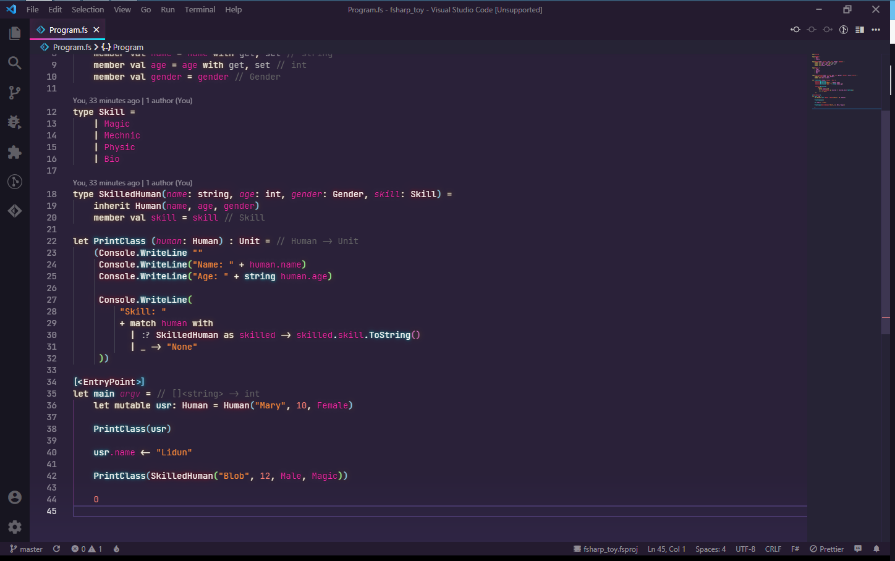

# SynthWave '84

## 前言

这是一款 `Visual Studio Code` 上的霓虹灯主题

默认效果预览

<details>



</details>

## 配置

### VSC 内配置

- Brightness:
  亮度, 取值区间为 0.0 到 1.0
- Disable Glow:
  禁用发光效果

### 外部配置

> 参考文档 [`Github Issue`](https://github.com/robb0wen/synthwave-vscode/issues/199)

#### 在 VSC 内配置

某些配色可以在 `Visual Studio Code` 的 `settings.json` 内完成配置

例如某窗口的背景色, 进度条颜色等

```json
"workbench.colorCustomizations": {
    "[SynthWave '84]": {
        "scrollbarSlider.background": "#541388",
        "scrollbarSlider.hoverBackground": "#650D89",
        "scrollbarSlider.activeBackground": "#541388",
        "editor.lineHighlightBackground": "#4d3d7666",
        "list.activeSelectionBackground": "#4d3d7666",
        "list.hoverBackground":  "#4d3d7666",
        "list.focusBackground": "#4d3d7666",
        // ...: "#......",
    },
},
```

此处全部可用配置项可在 [`Visual Studio Code` 官网](https://code.visualstudio.com/api/references/theme-color) 找到

#### 修改 SynthWave 默认配置

某些配色是写在 SynthWave 自己的配置文件里的

本体应当位于 `用户目录/.vscode/extensions/robbowen.syhthwave-vscode-版本/`

你可以在 `themes/` 下找到默认的配色方案并根据需要进行修改

例如默认的字符串配色是 `#ff8b39` 深橙色

在 `themes/synthwave-color-theme.json` 中找到

```json
{
    "name": "String",
    "scope": [
        "string.quoted",
        "string.template",
        "punctuation.definition.string"
    ],
    "settings": {
        "foreground": "#ff8b39"
    }
},
```

修改 `settings` 项使其改变